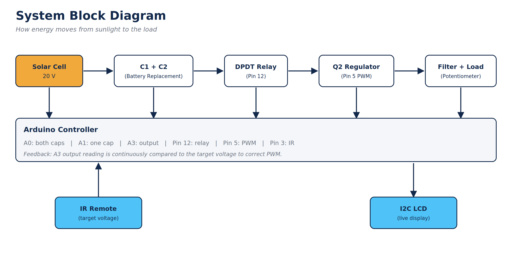

# Solar Charge Controller — Capacitor-Based Battery Replacement

An Arduino-based solar charge controller that replaces conventional batteries with a pair of switched capacitors, regulates a variable DC output (0–4.3 V) using closed-loop PWM feedback, and provides live status on an I2C LCD controlled by an IR remote.

Built for a FISA embedded systems project: *"Replacing Batteries with a Substitute in a Solar System."*

🔗 **[View the live Tinkercad simulation](https://www.tinkercad.com/things/goXEYWArAID-neat-blorr/editel?returnTo=%2Fdashboard%2Fdesigns%2Fcircuits&sharecode=2npJNZRqr3qB1h7GkVzy_zWhc67_kTlhl7pomqg1kYk)**

---

## How It Works

1. **Charging (parallel):** the relay is OFF, so both capacitors charge side by side to the full supply voltage.
2. **Discharging (series):** after a fixed charge time, the relay switches ON, reconnecting the capacitors end-to-end so their voltages combine.
3. **Regulation:** an NPN transistor (Q2), driven by an Arduino PWM pin, acts as an adjustable "tap" that sets the output voltage.
4. **Feedback control:** the Arduino continuously measures the real output voltage (A3) and nudges the PWM value up or down until it matches the target — this corrects for the circuit's non-linearity rather than relying on a single calculated PWM value.
5. **User input:** an IR remote lets the user type a two-digit target voltage (e.g. press `3` then `2` for 3.2 V), shown briefly on the LCD before the display returns to normal.

---

## Hardware

| Component | Role |
|---|---|
| Arduino (Uno / Uno R4 WiFi) | Main controller |
| 2× Capacitors (C1, C2) | Battery replacement / energy storage |
| DPDT relay | Switches C1/C2 between parallel and series |
| NPN transistor (Q1) | Relay coil driver |
| 1N4007 diode | Flyback protection for the relay coil |
| NPN transistor (Q2) | Output voltage regulator (PWM-controlled) |
| Resistor dividers (3.9 kΩ + 1 kΩ) | Scale 20 V down to a safe 0–5 V range for A0/A1 |
| Filter capacitor + small series resistor | Smooths the PWM output into steady DC |
| Potentiometer | Load, simulating a variable appliance draw |
| I2C LCD (16×2) | Live status display |
| IR receiver + remote | User input for target voltage |

### Pin Map

| Arduino Pin | Function |
|---|---|
| 12 | Relay control (digital out) |
| 5 | PWM output to Q2 base |
| 3 | IR receiver input |
| A0 | Voltage across both capacitors (divided) |
| A1 | Voltage across one capacitor (divided) |
| A3 | Regulated output voltage (direct, no divider — max 4.3 V) |
| SDA / SCL | I2C LCD |

---

## Software Features

- Automatic parallel ↔ series switching on a timer
- Two-digit IR remote input (e.g. `3`, `2` → 3.2 V), shown on LCD for 1 second before reverting
- Closed-loop PWM feedback: measured output is averaged over 20 ADC samples and corrected in small steps until it settles within ±0.05 V of the target
- Debounced IR input (rejects noise / accidental repeats without blocking a genuine fast second digit)
- LCD shows: parallel/series symbol, live output voltage, surname, both-capacitor voltage, single-capacitor voltage

---

## Key Calculations

See [`CALCULATIONS.md`](CALCULATIONS.md) for the full worked calculations (voltage dividers, PWM-to-voltage formula, filter RC time constant, capacitor drain rate).

---

## Known Limitations / Design Notes

- Output is capped at ~4.3 V by design — this comes from the Arduino pin's own 5 V limit (`V(base) − 0.7 V`), not the transistor or supply.
- A brief voltage transient can occur exactly when the relay switches parallel → series, as the capacitors' charge redistributes — this settles within the feedback loop's response window.
- Capacitor storage values were increased from an initial 1000 µF (which sagged too quickly under load) to hold a steadier, more "battery-like" discharge.

---

## Repository Contents

- `solar_charge_controller.ino` — main Arduino sketch
- `CALCULATIONS.md` — worked calculations referenced in the project report
- `block_diagram.png` — system block diagram (referenced above)
- `README.md` — this file

---

## Author

Nare Mashiachidi
